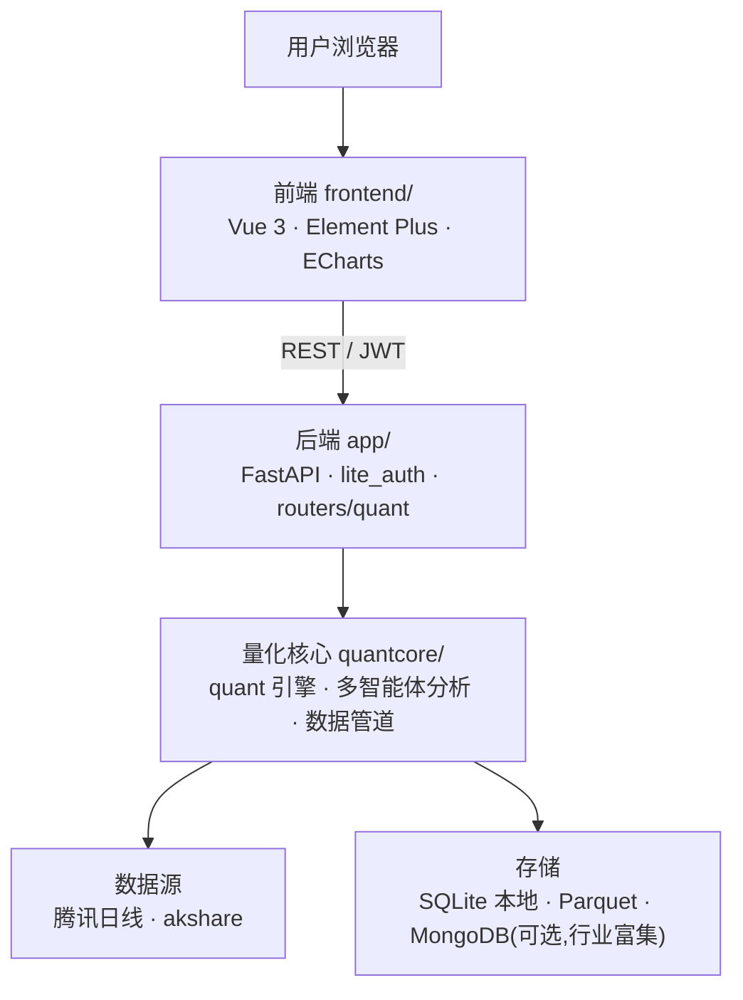

# AStockPick · A股优选

> **每一次选股，都经得起历史验证。** A 股全市场结构因子选股 + 12 个月回放验证的轻量 SaaS。


AStockPick 用本地日线在全市场（约 5000 只）做结构因子评分选股，**评分公式与 12 个月历史回放严格同源**——选出来的每一分都能被回放验证。区别于满大街的荐股工具：它用超额收益口径（相对全市场中位）说话、不承诺胜率、涨停买不到会如实标注、弱市该停跟会主动提示。多个 AI 智能体（行业 / 估值 / 情景）可对单只个股逐只深挖，产出可读的深度分析报告。

---

## ✨ 核心功能

- **全市场形态扫描** — 基于本地行情数据并行扫描全市场，标注金叉、突破、缩量等技术形态；自动叠加首层排除（停牌/ST 等）与基本面排除（预亏/预减）。
- **多智能体深度分析** — 行业、估值、情景多个 Agent 协同分析单只个股，一键生成 HTML 深度报告。
- **五方判读** — 价值/趋势/游资/逆向/量化 5 个 AI 人格对选股池候选批量打分，列表直接看共识分与分歧度，点开看各家立场与理由；同一股票当日只打一次。
- **行业热力图** — 全市场行业 treemap（面积=市值、颜色=当日涨跌幅），点行业下钻成分股、点个股直达深研；实时行情断档时自动退回本地日线。
- **专业 K 线图** — `KLineProChart` 组件：蜡烛图 + 均线 + MACD + 成交量 + 形态区域色块标注。
- **智能选股池** — 形态池 / smart-pool（v3 结构因子合成评分：MACD、布林位置、趋势、动量、资金流等，成交额 ≥3000 万门槛）；**评分函数与历史回放完全同源**，选出来的每一分都能被回放验证。
- **因子研究与回测** — MACD、布林、资金流等因子；内置回测（Calmar、盈亏比等指标，含 A 股交易成本）。
- **选股复盘（真实胜率+超额）** — 四个选股池（形态/智能/波段/竞价）每次扫描自动留痕，按真实行情统计 T+1/T+3/T+5 胜率、平均收益与**相对全市场中位的超额收益**（区分策略能力与大盘涨跌）；数据同步缺口自动检测、自动补齐并从统计中排除；数据说话，不承诺胜率。评分公式一旦变更即换池名，旧公式的战绩不会挂到新公式名下。
- **历史回放验证** — 用本地日线把形态/智能两池规则 point-in-time 回放 12 个月（每 5 个交易日采样、每期 top-N），输出月度超额胜率与累计超额曲线；**双口径**（收盘回测 / 次日开盘可成交）+ 中位数与涨停占比标注 + 一句话结论卡，选股规则有效还是无效直接看数据（结论见 `docs/superpowers/specs/2026-07-13-replay-validation-report.md`）。
- **入选理由卡** — 选股列表每只票可点开「理由」抽屉：因子分解、入选理由、交易计划、该信号的历史 T+5 超额表现（实盘留痕 + 历史回放双口径）。
- **大盘环境标签** — 全市场 5 日中位涨幅 + 上涨占比推导「偏暖/中性/偏冷」，选股页顶部横幅提示当前环境下的仓位建议。
- **宏观指标条** — 全站顶部实时显示三大指数、涨跌家数与两市成交额。
- **自选股与价格预警** — SQLite 持久化自选股，价格预警触发。
- **行情数据同步** — 腾讯日线为主、akshare 兜底；支持全市场本地同步与增量更新。

## 📸 截图

<!-- 把截图放到 docs/screenshots/ 下，替换下面的占位路径即可 -->
| 形态扫描 | 深度分析报告 |
|---|---|
|  |  |
| **K 线图** | **选股池** |
|  |  |

## 🏗️ 架构



- **前端** `frontend/`：Vue 3 + Element Plus + ECharts，`ApiClient` 统一封装请求与 JWT。
- **后端** `app/`：FastAPI 轻量服务，`lite_main` 装配认证 (`lite_auth`) 与量化路由 (`routers/quant`)，认证与自选股存 SQLite。
- **量化核心** `quantcore/`：形态扫描、多智能体深度分析、K 线服务、数据管道与本地行情存储。

## 🚀 快速开始

### 一键启动（推荐，Windows）

```powershell
.\scripts\start_lite.ps1
```

后端 `app.lite_main` 跑 **8001**、前端 vite 跑 **5173**，起完自动打开浏览器。端口已占用则跳过（幂等，可重复执行）。常用参数：`-NoOpen`（不弹浏览器）、`-NoBackend` / `-NoFrontend`（只起一边）、`-BackendPort` / `-FrontendPort`（改端口，前端代理自动跟随）。首次需先在 `frontend/` 执行过 `npm install`。

### 手动启动

#### 后端

```bash
pip install -e .
# 可选：.env 设置 JWT_SECRET；MONGO_URI（不设则关闭行业富集，不影响主流程）
uvicorn app.lite_main:app --reload --port 8001
```

#### 前端

```bash
cd frontend
npm install
npm run dev      # 开发（vite 5173，/api 代理至后端 8001）
npm run build    # 生产构建
```

前端开发期 `/api` 经 vite 代理至后端（`VITE_DEV_API_TARGET`，默认 `http://127.0.0.1:8001`）。

## 📁 目录结构

```
lynxagent/
├─ app/                 FastAPI 后端（认证、量化路由）
├─ frontend/            Vue 3 前端
├─ quantcore/       量化核心（quant 引擎、多智能体分析、数据管道）
├─ pyproject.toml       后端打包配置
└─ requirements.txt
```

## 📄 许可

专有软件，版权归 Allen Ma / 深圳迈彩视觉有限公司所有。许可条款见 [`LICENSE`](./LICENSE)，版权声明见 [`NOTICE`](./NOTICE)。
