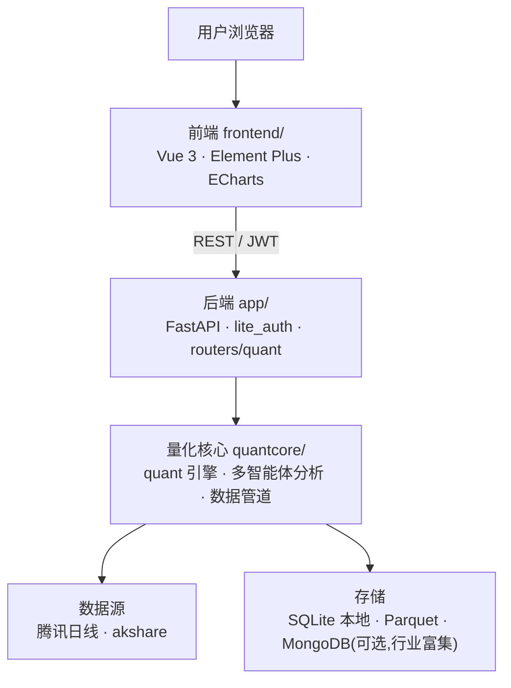

# LynxAgent

> **See the patterns others miss.** A 股量化形态选股 + 多智能体深度分析的轻量 SaaS。


LynxAgent 把「全市场形态扫描」和「多智能体深度研究」合到一个轻量产品里：先用本地行情数据在全市场（约 5000 只）里扫出技术形态候选，再让多个 AI 智能体（行业 / 估值 / 情景）逐只深挖，产出可读的深度分析报告。

---

## ✨ 核心功能

- **全市场形态扫描** — 基于本地行情数据并行扫描全市场，标注金叉、突破、缩量等技术形态；自动叠加首层排除（停牌/ST 等）与基本面排除（预亏/预减）。
- **多智能体深度分析** — 行业、估值、情景多个 Agent 协同分析单只个股，一键生成 HTML 深度报告。
- **专业 K 线图** — `KLineProChart` 组件：蜡烛图 + 均线 + MACD + 成交量 + 形态区域色块标注。
- **智能选股池** — 形态池 / smart-pool，结合排除规则与 MA20 趋势锚点输出候选。
- **因子研究与回测** — MACD、布林、资金流等因子；内置回测（Calmar、盈亏比等指标）。
- **自选股与价格预警** — SQLite 持久化自选股，价格预警触发。
- **行情数据同步** — 腾讯日线为主、akshare 兜底；支持全市场本地同步与增量更新。

## 📸 截图

<!-- 把截图放到 docs/screenshots/ 下，替换下面的占位路径即可 -->
| 形态扫描 | 深度分析报告 |
|---|---|
|  |  |
| **K 线图** | **选股池** |
|  |  |

## 🏗️ 架构



- **前端** `frontend/`：Vue 3 + Element Plus + ECharts，`ApiClient` 统一封装请求与 JWT。
- **后端** `app/`：FastAPI 轻量服务，`lite_main` 装配认证 (`lite_auth`) 与量化路由 (`routers/quant`)，认证与自选股存 SQLite。
- **量化核心** `quantcore/`：形态扫描、多智能体深度分析、K 线服务、数据管道与本地行情存储。

## 🚀 快速开始

### 后端

```bash
pip install -e .
# 可选：.env 设置 JWT_SECRET；MONGO_URI（不设则关闭行业富集，不影响主流程）
uvicorn app.lite_main:app --reload --port 8000
```

### 前端

```bash
cd frontend
npm install
npm run dev      # 开发
npm run build    # 生产构建
```

前端通过 `VITE_API_BASE_URL` 指向后端（如 `http://localhost:8000`）。

## 📁 目录结构

```
lynxagent/
├─ app/                 FastAPI 后端（认证、量化路由）
├─ frontend/            Vue 3 前端
├─ quantcore/       量化核心（quant 引擎、多智能体分析、数据管道）
├─ pyproject.toml       后端打包配置
└─ requirements.txt
```

## 📄 许可

专有软件，版权归 Allen Ma / 深圳迈彩视觉有限公司所有。许可条款见 [`LICENSE`](./LICENSE)，版权声明见 [`NOTICE`](./NOTICE)。
